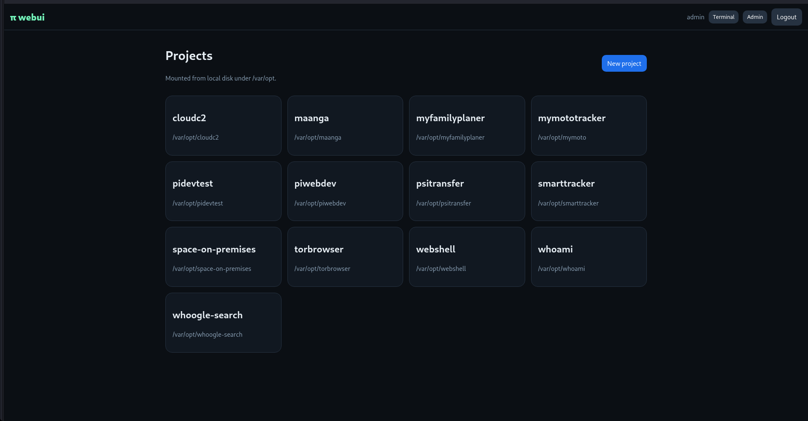
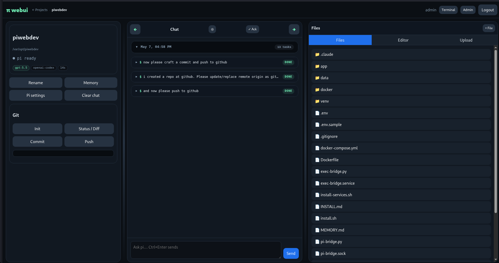
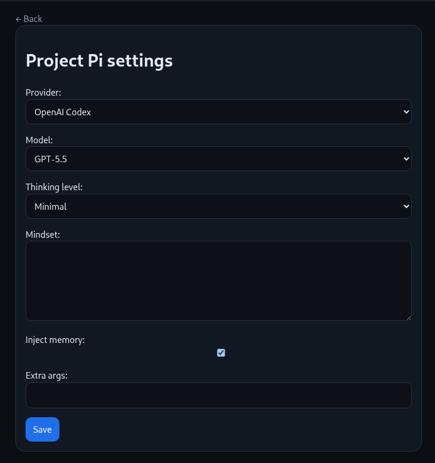
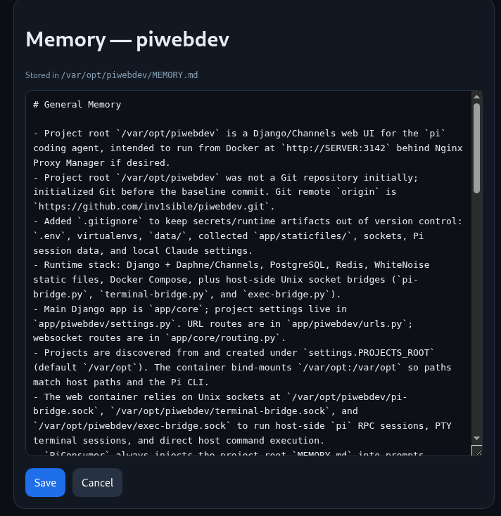
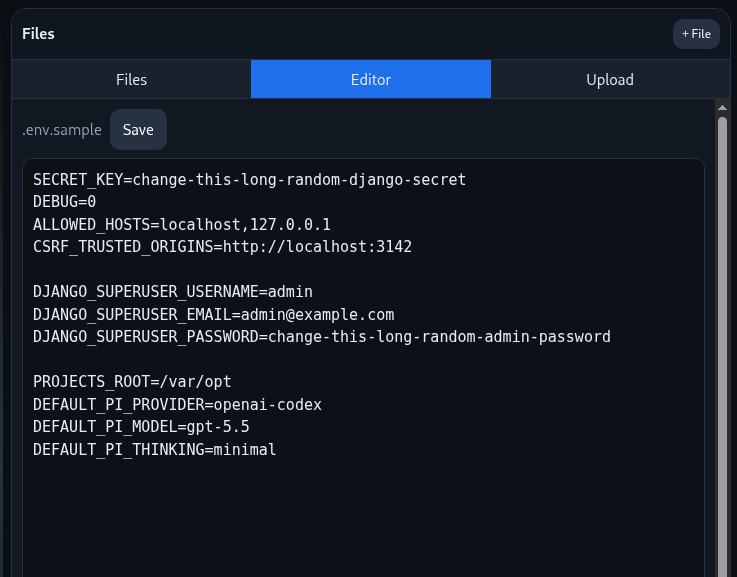
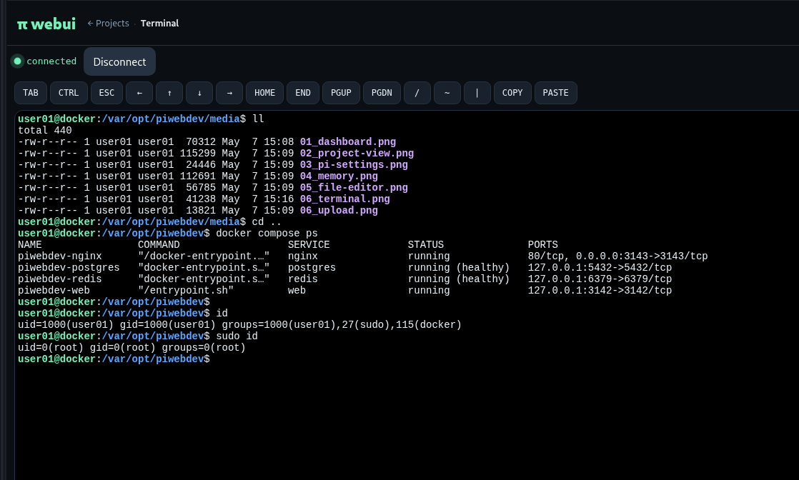
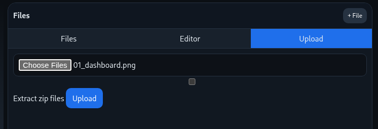

# piwebdev

A Django/Channels web UI for the [`pi`](https://www.npmjs.com/package/@mariozechner/pi-coding-agent) coding agent. It lets trusted teammates open server-side projects, chat with Pi in persistent sessions, browse and edit files, review Git changes, and optionally use a browser terminal.

piwebdev is intended for self-hosted review/development environments. The recommended deployment is Docker Compose on a Linux host, usually exposed at `http://SERVER:3142` or behind a reverse proxy such as Nginx Proxy Manager.

## Features

- **Project dashboard** – discover existing projects and create new ones under `PROJECTS_ROOT` (`/var/opt` by default).
- **Persistent Pi chat** – WebSocket chat backed by a host-side `pi-bridge.py` process running the real Pi CLI.
- **Reconnect/resume behavior** – browser reconnects can recover in-progress work and replay buffered output.
- **Project memory** – view/edit each project’s `MEMORY.md`; project root memory is injected into Pi prompts.
- **File browser/editor** – safe path handling, uploads/downloads, protected zip extraction, and noisy directory hiding.
- **Git tools** – initialize repositories, inspect status/diffs, stage/commit, and push.
- **Optional browser terminal** – per-user gated terminal access through a host-side PTY bridge.
- **PWA support** – manifest, service worker, and offline page for installable browser use.
- **Admin controls** – Django admin for users, Pi settings, sessions, and chat messages.

## Screenshots

| Project dashboard | Project chat | Pi settings |
| --- | --- | --- |
|  |  |  |
| Project dashboard panel. | Main chat view of a project. | Define pi.dev settings at project level. |

| Project memory | File editor | Web terminal |
| --- | --- | --- |
|  |  |  |
| The brain of piwebdev: update `MEMORY.md`, for example with a prompt like “analyze code base and update memory”. | Review and edit files directly on the host. | Web terminal for solving operational tasks such as `sudo` workflows. |

| Uploads |  |  |
| --- | --- | --- |
|  |  |  |
| Upload files to the host. WIP. |  |  |

## Architecture

Docker Compose runs:

- `web`: Django + Daphne + Channels + WhiteNoise.
- `postgres`: application database.
- `redis`: Channels/cache backend.
- `nginx`: optional local container proxy on port `3143`.

Host-side Unix socket bridges run outside Docker:

- `pi-bridge.py` manages persistent `pi rpc` sessions.
- `terminal-bridge.py` manages optional browser PTY sessions.
- `exec-bridge.py` provides host command execution for integrations that need it.

The web container bind-mounts host `/var/opt` as `/var/opt` so project paths match between Django, the host bridges, Git, and the Pi CLI.

> **Security note:** piwebdev is for trusted users. Authenticated users may be able to read/write project files, run Git operations, invoke host-side Pi work, and use terminal/host execution features depending on permissions. Do not expose it as an untrusted public multi-tenant service.

## Installation

See **[INSTALL.md](INSTALL.md)** for the full setup guide, including prerequisites, Docker Compose, host bridge systemd services, installer overrides, reverse proxy notes, and troubleshooting.

Minimal automated outline:

```bash
cd /var/opt
git clone <YOUR_GITHUB_REPO_URL> piwebdev
cd piwebdev
./install.sh
```

`install.sh` installs prerequisites, the Pi npm package, starts Docker Compose, and installs the host bridge services. See [INSTALL.md](INSTALL.md) for configuration, overrides, and manual steps.

## Configuration

Important `.env` settings:

- `SECRET_KEY`: Django secret key; use a long random value.
- `DEBUG`: keep `0` in shared/review deployments.
- `ALLOWED_HOSTS`: comma-separated hostnames/IPs allowed by Django.
- `CSRF_TRUSTED_ORIGINS`: full origins such as `https://pi.example.com`.
- `DJANGO_SUPERUSER_*`: bootstrap admin credentials used on container startup.
- `PROJECTS_ROOT`: host/container project root, default `/var/opt`.
- `DEFAULT_PI_PROVIDER`, `DEFAULT_PI_MODEL`, `DEFAULT_PI_THINKING`: default Pi settings shown in forms.

For HTTPS reverse-proxy deployments, also consider:

```env
SESSION_COOKIE_SECURE=1
CSRF_COOKIE_SECURE=1
```

## Storage

Docker Compose stores service data under `./data`:

- `./data/postgres`
- `./data/redis`
- `./data/media`
- `./data/uploads`

Projects live under host `/var/opt` by default. Runtime sockets such as `pi-bridge.sock`, `terminal-bridge.sock`, and `exec-bridge.sock` are created in the repository directory on the host and are intentionally not committed.

## Operations

Useful commands:

```bash
docker compose ps
docker compose logs -f web
journalctl -u pi-bridge -f
journalctl -u terminal-bridge -f
```

Run Django management commands inside the web container:

```bash
docker compose exec web python manage.py createsuperuser
```

## Installer scripts

- `install.sh` bootstraps a Docker Compose deployment and can install the Pi npm package plus bridge services.
- `install-services.sh` only installs/updates the host-side `pi-bridge`, `terminal-bridge`, and `exec-bridge` systemd services.
